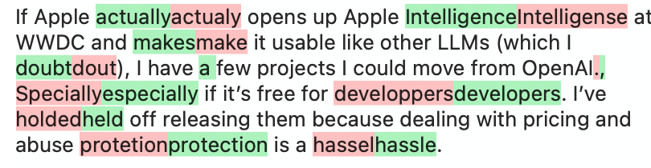

# 🧬 TextDiffing

TextDiffing helps you visually identify differences between two texts, with options for customizing tokenization and formatting of changes.



## 📦 Adding the Package

TextDiffing is distributed using [Swift Package Manager](https://www.swift.org/documentation/package-manager/). Install TextDiffing in a project by adding it as a dependency in your Package.swift manifest or through “Package Dependencies” in project settings.

```swift
let package = Package(
    dependencies: [
        .package(url: "git@github.com:simonbs/textdiffing.git", from: "1.0.1")
    ]
)
```

## 🚀 Getting Started

Use the TextDiffer to compare two strings.

```swift
let result = TextDiffer.diff(text, and: otherText)
let changeCount = result.changeCount
let attributedString = result.attributedString
```

The `TextDiffer.diff(_:and:)` method also takes the following options.

|Option|Description|
|-|-|
|`strikethroughRemovedText`|Adds a strikethrough to removed text.|
|`tokenizeByCharacter`|Tokenizes the input by individual characters.|
|`tokenizeByWord`|Tokenizes the input by words (default).|

You can combine multiple options. By default, text is tokenized by word.

```swift
let result = TextDiffer.diff(text, and: otherText, options: [.tokenizeByCharacter, .strikethroughRemovedText])
```

You may also use the extensions on NSAttributedString and AttributedString.

```swift
let attributedString = AttributedString(diffing: text, and: otherText)
```

```swift
let attributedString = NSAttributedString(diffing: text, and: otherText)
```

You can customize the appearance of inserted and removed text by providing your own TextDiffStyle. This lets you control the background color used for visual highlighting.

```swift
let style = TextDiffStyle(
  insertedBackground: UIColor.systemGreen.withAlphaComponent(0.3),
  removedBackground: UIColor.systemRed.withAlphaComponent(0.3)
)
let result = TextDiffer.diff(text, and: otherText, style: style)
```
